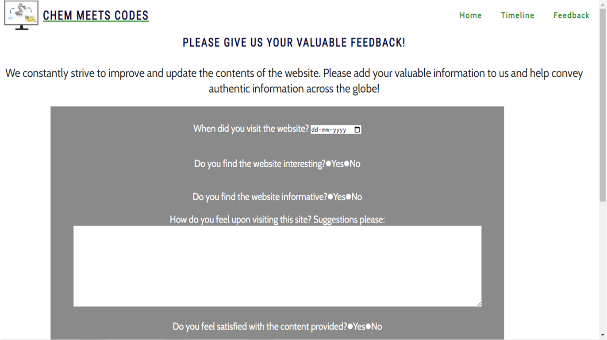

<h1 style="font-style: 'Calibri'; text-decoration:underline;"><strong>CHEM MEETS CODES</strong></h1>

<h3><i>A website for Scientists and Techies alike.. </h3>
 

This website attempts to give you a glimpse into how two totally unrelated fields find a synchrony, paving way for new fields to emerge. The emergence and evolution of Computers, its Programming Languages and internet has created many interdisciplinary fields in science today. The website walks you through the history of computer-aided drug design and how it came to existance.
</i>

<h2 style="font-style: 'Calibri', sans-serif; font-weight: 600">PERSPECTIVE</h2>

<strong>CHEM MEETS CODES </strong> is much like my own story - "A Chemist learning to Code". 
The word Chemist is a misnomer to define me, while the area of research as a Chemist often spans several disciplines these days. My experience ranges from Synthetic Organic Chemistry, Bio-organic Chemistry, Supramolecular Chemistry, Biomaterials to Cell Biology. This shows that no single subject defines our field of study today. It is an era of <i>"Interdisciplinarity/ Interdisciplinary Studies"</i>. No research project exists today that doesn't tow the same line or speak one language. So are the Techies, so many different programming languages co-existing brilliantly to get to a higher goal usually termed <i>Website, App or Software</i>, just to name a few. Chemists use often without how so many powerful and brilliantly engineered softwares are built. And so is it with the Coders/ Programmers who are unaware of the scientific fields Computers and the languages built have transformed. 
 
This website tries to bring the stories of two worlds together and attempts to show how their timelines progressed. It is a work in progress and provides an introduction to the history of the two constantly progressing fields.

<h2 style="font-style: 'Calibri', sans-serif; font-weight: 600">INTRODUCTION</h2>
A history based website displaying how programming languages and computational chemistry evolved over the last decade. The website provides the details on the timeline of the new field "computer-aided drug design (CADD)" emerged and advanced with the programming language and Information Technology Evolution. And how it has impacted our lives, and its importance in the present and future. 
 
 
<h2 style="font-style: 'Calibri', sans-serif; font-weight: 600";>DESCRIPTION</h2>

Chem Meets Codes is a website developed broadly for students, computational research enthusiasts and IT application enthusiasts. Website discusses the topic of Structural evolution in Chemistry and  Programming Language evolution in Computers. Thus, it would be appealing to students and researchers with a biological/chemical as well as a computational background. Topics are planned to be continuously expanded and open for contributions from the community. 

 

<h2 style="font-style: 'Calibri', sans-serif; font-weight: 600">WEBSITE FEATURES</h2>

The website features three webpages (can be found in the navigation menu featured on the upper right hand corner of each page). First page is <a href="index.html">Homepage</a>, which is also the landing page. As it is a history based website, another webpage featuring <a href="timeline.html">Timeline</a> is included. As this is an attempt to bring two mega giants of fields together. This website has a scope of contantly to be updated, which is enormous. That is why a third webpage <a href="feedback.html">Feedback</a> is included. Visitors to the website can enter their feedback and comments, referring to which further updates can be regularly included in the website.

 
<h3 style="font-style: 'Calibri', sans-serif; font-weight: 600">HOME</h3>

The homepage has logo to the left, navigation menu bar at the top right corner. The navigation links connect to the different pages on the website.

  Appearance on Desktop:

  Appearance on Phone:

The homepage contains introductary sections to different topics. It contains clickable links to many websites.

  Each page also contains a footer with links to different social media platorm to connect with me. There are links to linkedin, twiter and facebook.

 

<h3 style="font-style: 'Calibri', sans-serif; font-weight: 600">TIMELINE</h3>

Similar to homepage, timeline page has has logo to the left, navigation menu bar at the top right corner. The navigation links connect to the different pages on the website.

  Appearance on Desktop:

  Appearance on Phone:

The timeline page provides a glimpse into the last decades developments. It also contains a section: Interesting References with links for the readers to dig deeper into history.

 

<h3 style="font-style: 'Calibri', sans-serif; font-weight: 600">FEEDBACK</h3>

Feedback page provides site users and visitors to give their valuable feeback in a form. Users can enter details such as, their date of visit, interests and how informative was the website to them. 

  Appearance on Desktop:

  Appearance on Phone:

There is a Submit button provided at the bottom of the form. Users can enter the details and submit.

<h2 style="font-style: 'Calibri', sans-serif; font-weight: 600">DESIGN</h2>
<h3 style="font-style: 'Calibri', sans-serif; font-weight: 600">LOGO IMAGE</h3>

Logo and the image features the codes create the softwares that facilitate the design of modern day drugs. The monitor or a desktop suggests that all the planning and design happens inside a computer,

 

<h3 style="font-style: 'Calibri', sans-serif; font-weight: 600">TYPOGRAPHY</h3>
Google Fonts was used for the following fonts: was used for the following fonts: 
Font-family= Cabin, ffor all the paragraphs and normal text.
Font-family= Roboto Condensed:400,700 for all headings.
 
 
<h2 style="font-style: 'Calibri', sans-serif; font-weight: 600">RESPONSIVE DESIGN</h2>
<ul>
    <li>The layout Home/index.html utilises Flex styling for responsiveness.</li>
    <li>Media queries are used in the website to adjust to the available space on different screen sizes.</li>
</ul>
 

<h2 style="font-style: 'Calibri', sans-serif; font-weight: 600">TECHNOLOGIES</h2>
<h3 style="font-style: 'Calibri', sans-serif; font-weight: 600">PROGRAMMING LANGUAGES</h3>

This website is created purely using HTML5 and CSS3.

 

<h3 style="font-style: 'Calibri', sans-serif; font-weight: 600">WIREFRAMES</h3>

To model the webpages and to better design the User Interfaces, Wireframes were created for the website using <a href="https://balsamiq.com/"> Balsamiq</a>.

 

<h2 style="font-style: 'Calibri', sans-serif; font-weight: 600">DEVELOPMENT</h2>

 GitHub pages were used to deploy the site.

The steps to activate Github pages:

<ul>
    <li>First the repository was created using the gitpod template provided by the Code Insitute.</li>
    <li>Using the command <i>git add <filename></i>, the changes are staged to be pushed into the repository and staged changes are committed tp the local repository using <i>git commit -m 'short descriptive message'.</i></li>
    <li>Using <i>git push</i>, the changes are updated in the repository.</li>
    <li> Github automatically deploys my latest commit from the 'main' branch to the Github pages.</li>
</ul>

 
<h2 style="font-style: 'Calibri', sans-serif; font-weight: 600">LIBRARIES AND PROGRAMS</h2>
<ul>
    <li>Git - For version control</li>
    <li>GitHub - To create my repositories, save and store my project files</li>
    <li>Google Fonts - To import fonts</li>
    <li>Font Awesome - For the iconography used in footer and links</li>
    <li>Google Dev Tools - To debug, troubleshoot and test features and adjust property values. Using the Lighthouse extension installed in Chrome Browser, the performance report was generated.</li>
</ul>
 

<h2 style="font-style: 'Calibri', sans-serif; font-weight: 600">VALIDATION</h2>
<h3 style="font-style: 'Calibri', sans-serif; font-weight: 600">HTML</h3>

To test compliance with HTML standards, the <a href= "https://validator.w3.org/">W3C Markup Validation Service</a> was used. 

 <strong>Result of HTML Home page validation (index.html) validation</strong>: No errors found.

 

 <strong>Result of HTML Timeline page validation(timeline.html) validation</strong>: No errors found.

 

 <strong>Result of HTML Feedback page validation(feedback.html) validation</strong>: No errors found.

 

<h3 style="font-style: 'Calibri', sans-serif; font-weight: 600">CSS</h3>

To test compliance with HTML standards, the <a href= "https://jigsaw.w3.org/css-validator/">W3C CSS Validation Service - Jigsaw</a> was used. 

 

 <strong>Result of CSS validation</strong>: No errors found.

 

<h2 style="font-style: 'Calibri', sans-serif; font-weight: 600">TESTING</h2>

To test the performance, quality, and correctness of your web pages, <a href= "https://chrome.google.com/webstore/detail/lighthouse/blipmdconlkpinefehnmjammfjpmpbjk?hl=en">Lighthouse</a> chrome extension tool was used. 

 <strong>Result of Lighthouse performance check </strong>of Home page(index.html)

 

 <strong>Result of Lighthouse performance check </strong>of Timeline page(timeline.html)

 

 <strong>Result of Lighthouse performance check </strong>of Feedback page(feedback.html)

 

<h2 style="font-style: 'Calibri', sans-serif; font-weight: 600">BROWSER COMPATIBILITY</h2>
The website was tested in Google Chrome, Mozilla Firefox, and Microsoft Edge. It works well in all browsers.

<h2 style="font-style: 'Calibri', sans-serif; font-weight: 600">DEPLOYMENT</h2>

 GitHub pages were used to deploy the site.

The steps to activate Github pages:

<ul>
    <li>Navigate to the <i>Settings</i> tab in the GitHub repository.</li>
    <li>Navigate to the 'Pages' tab on the left of the page.</li>
    <li>Go to the 'Build and deployment' section, select 'Deploy from a branch' in the <i>source</i> dropdown.</li>
    <li>Select branch 'main' and click on 'Save'.</li>
    Link generated: https://roshnavakkeel.github.io/Chem_Meets_Codes/index.html
</ul>

<h2 style="font-style: 'Calibri', sans-serif; font-weight: 600">CREDITS</h2>
<h3 style="font-style: 'Calibri', sans-serif; font-weight: 600">CONTENTS</h3>
<ul>
    <li> <a href="https://www.pexels.com/">Pexels</a> for the cover image.</li>
    <li>The fonts are imported from <a href="https://fonts.google.com/">Google Fonts</a>.</li>
    <li>The icons in the footer, testimonials and services section were taken from <a href= "https://fontawesome.com/">FontAwesome</a>.</li>
     <li>The video file was converted from .avi file to .mp4 file extension using <a href= "https://www.freeconvert.com/avi-to-mp4">FreeConvert</a>.</li>
</ul>

<h3 style="font-style: 'Calibri', sans-serif; font-weight: 600">MEDIA</h3>

Many pictures in the Home page are developed by me using MS Office Powerpoint and have been saved as pictures as .png files such as, Logo.png, project_example.png (Used in Mission section), Molecules.png (Used in Chemical Structure section), Comp_intro.png (Used in Programming Language section), CADD_impact.png (Used in Impact section),etc.

Pictures from web:

<ul> 
    <li>Cover_image_bkg.jpg (Cover image in Home section) was taken from  the<a href="https://www.pexels.com/de-de/foto/liebe-menschen-kunst-herz-7723534/" target="_blank">link</a> from Pexels. </li>
    <li>CADD_to_Drug.png (Used in Computer Aided Drug Design section) was taken from  the<a href="https://javaconceptoftheday.com/history-of-programming-languages/" target="_blank">link</a> </li>
    <li>Programming_lang_timeline_timeline (Used in Timeline page) was taken from the <a href="https://www.researchgate.net/publication/325095935_Structure-Based_Drug_Design_Workflow" target="_blank">link</a> and modified by me. </li>
    <li>CADD_timeline (Used in Timeline page) was taken from the <a href="https://twitter.com/hideyoshifuji/status/1315670514438873088" target="_blank">link</a> and modified by me.</li>
</ul>

<h2 style="font-style: 'Calibri', sans-serif; font-weight: 600">ACKNOWLEDGEMENTS</h2>

I would like to acknowledge the following people who have helped me along the way in completing my first milestone project:

<ul>
    <li>My Mentor Jubril Akolade for his guidance, best suggestions and constant encouragement. </li>
    <li>My fellow students for their company and encouragement. Special thanks to Kristyna Maulurova for all her kind support.</li>
    <li>My tutors who helped me understand the concepts better.</li>
</ul>

